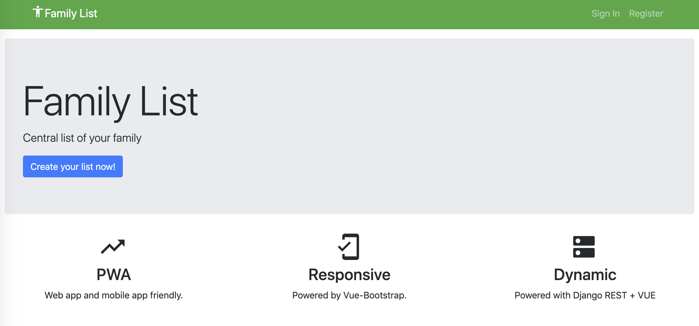

# Family List

> Central todo list pwa app



# Tech Stack
- vue cli 2
- python 3.x
- Django

## Setup

``` bash
# install dependencies
npm install

# build for production with minification
npm run build

# install python requirements, please use virtualenv
pip install requirements.txt

# start the django http server
python manage.py runserver
```

For detailed explanation on how things work, checkout the [guide](http://vuejs-templates.github.io/webpack/) and [docs for vue-loader](http://vuejs.github.io/vue-loader).

# Resources
- https://medium.com/@williamgnlee/simple-integrated-django-vue-js-web-application-configured-for-heroku-deployment-c4bd2b37aa70
- https://hackernoon.com/jwt-authentication-in-vue-js-and-django-rest-framework-part-1-c40c5c0d4f6e

# Demo
https://todo-django-vue-pwa.herokuapp.com
